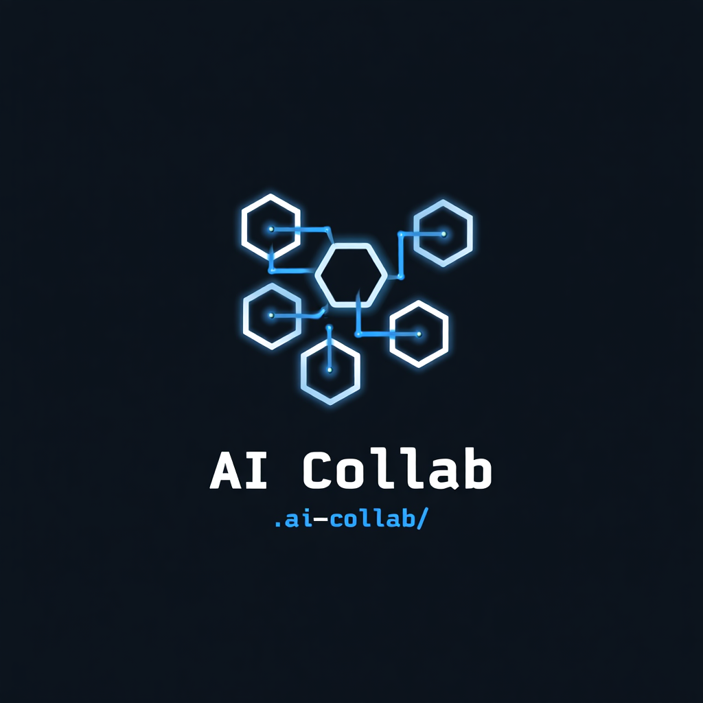

<div align="center">



<br>

# AI Collab Skill

[](LICENSE)
[](https://github.com/gsepcore/ai-collab-skills)
[](https://claude.ai/code)
[](https://gsepcore.com)

**Permite que múltiples IAs trabajen en el mismo proyecto simultáneamente — y que realmente se vean entre sí.**

Creado por **Luis Alfredo Velasquez Duran** | Alemania, 2025-2026

[GitHub](https://github.com/gsepcore/ai-collab-skills) · [Instalar en 2 comandos](#instalación) · [gsepcore.com](https://gsepcore.com)

🇬🇧 **English?** Read the [English README](README.md)

</div>

---

Cuando usas Claude Code junto con Cursor, Windsurf, Codex, OpenCode u otra herramienta de IA, están completamente ciegas entre sí. Este skill crea un protocolo de filesystem compartido para que puedan leer y escribir contexto en tiempo real — sin servicio externo, sin API, sin internet. Solo una carpeta `.ai-collab/` dentro de tu proyecto.

---

## Cómo funciona

Cada IA escribe un log de sesión en Markdown dentro de `{raíz-del-proyecto}/.ai-collab/`. Cualquier IA con acceso al filesystem del proyecto puede leer esos logs al instante. Claude gestiona su propio log mediante este skill. Las demás IAs participan a través de snippets simples que se agregan a sus archivos de reglas (`.cursorrules`, `.windsurfrules`, etc.) — configuración de una sola vez por proyecto.

```
tu-proyecto/
└── .ai-collab/
    ├── PROTOCOL.md                   ← protocolo compartido (se crea automáticamente)
    ├── TEAM.md                       ← agentes registrados + container/model/rules
    ├── agents.json                   ← manifiesto machine-readable de agentes
    ├── inbox-all.md                  ← tareas broadcast para cualquier IA
    ├── inbox-codex.md                ← tareas asignadas específicamente a Codex
    ├── inbox-opencode.md             ← tareas asignadas específicamente a OpenCode
    ├── thread-20260512-task.md       ← conversación agente-a-agente de una tarea
    ├── discussions/                  ← preguntas/propuestas/decisiones naturales
    │   └── discussion-20260616-api.md
    ├── live/                         ← snapshots semánticos + screenshots automáticos
    │   ├── summary.json              ← estado actual de cada agente registrado
    │   ├── health.json               ← diagnóstico del observer/screenshots/OCR
    │   ├── opencode.json             ← estado vivo inferido para OpenCode
    │   ├── opencode.agent.json       ← estado reportado por OpenCode
    │   └── screenshots/              ← PNGs + sidecars .semantic.json, ignorados por git
    ├── claude-20260511-143022.md     ← log de Claude Code
    ├── cursor-20260511-141500.md     ← log de Cursor
    ├── codex-20260511-141000.md      ← log de Codex
    └── opencode-20260511-140500.md   ← log de OpenCode
```

---

## Arquitectura: director, workers autónomos, aislamiento por proyecto

Tres principios definen cómo funciona la skill. Léelos antes de instalar — explican el diseño y qué esperar.

### 1. Claude Code es el director por defecto

Normalmente interactúas con **Claude Code** como la IA orquestadora. Claude es la única asistente que:

- Tiene hooks live `UserPromptSubmit` / `Stop` / `SessionStart` que surface notificaciones y regeneran `CONTEXT.md` automáticamente.
- Posee los slash commands `/collab` — `/collab assign`, `/collab read`, `/collab monitor`, etc.
- Escribe asignaciones de tareas en `.ai-collab/inbox-{ai}.md` para que los workers las recojan.

Las otras IAs (Cursor, Windsurf, OpenCode, Codex, Copilot, Antigravity, Hermes, etc.) son **workers** por defecto. Participan leyendo su archivo de reglas y el directorio `.ai-collab/` — sin hooks, sin slash commands.

Los workers *pueden* técnicamente leer logs de los demás y editar cualquier archivo, pero la delegación de tareas fluye desde Claude hacia afuera. Esto mantiene la coordinación centralizada y evita situaciones ambiguas de "quién decide aquí".

Para planes grandes de implementación, el usuario puede iniciar un **run dirigido** y elegir el director de ese run (`claude-code`, `codex`, `opencode` u otro agente registrado). El director seleccionado recibe un lock en `.ai-collab/runs/{run_id}/director.json`; los demás agentes actúan como workers para ese run hasta que el lock se libera. Así Codex puede dirigir un run mientras Claude Code dirige otro sin pisarse.

### 1.5 El director conoce al equipo desde el inicio de la sesión

Para que Claude delegue bien, necesita saber quién más está en el proyecto. El hook `Stop` regenera `.ai-collab/CONTEXT.md` después de cada respuesta de Claude, y `CONTEXT.md` incluye una **sección `## Team`** construida desde tres fuentes:

1. **`.ai-collab/TEAM.md`** (manifest explícito, tiene precedencia) — generado por `/collab setup`. Lista cada slug pensado para participar, incluso antes de que hayan escrito un log.
2. **Archivos de reglas únicos** en la raíz del proyecto — `.cursorrules` → cursor, `.windsurfrules` → windsurf, `.github/copilot-instructions.md` → copilot, `.aider.conf.yml` → aider.
3. **Logs existentes** en `.ai-collab/` — cualquier `{slug}-*.md` significa que esa IA ha estado activa al menos una vez.

`AGENTS.md` lo comparten OpenCode, Codex, Aider, Continue y otros — su presencia sola es ambigua, así que esas IAs solo aparecen en la sección Team una vez que han escrito un log O están listadas explícitamente en `TEAM.md`. Una nota debajo del roster te recuerda que pueden unirse más IAs compatibles con AGENTS.md.

Esto significa que la próxima vez que Claude abra un proyecto, ve un roster como:

```
## Team
- **claude** — director (Claude Code skill) · last seen 12min ago
- **cursor** — registered via `.cursorrules` · no logs yet
- **opencode** — registered via `AGENTS.md` · last seen 3min ago
- **codex** — declared in `TEAM.md` · last seen 4h ago
```

…y puede asignar tareas confiadamente vía `/collab assign codex …` sin tener que preguntarte primero "¿Codex está en este proyecto?".

### 2. Los workers reaccionan autónomamente a asignaciones

Nunca tienes que copiar una tarea desde la ventana de Claude a la ventana de OpenCode. El protocolo lo maneja vía filesystem:

```
Tú → Claude: "refactoriza auth y que Codex publique v1.1.0"
       │
       ↓
Claude escribe .ai-collab/inbox-codex.md con status: unread
       │
       ↓
Más tarde: abres Codex en cualquier terminal (cuando quieras, sin prisa)
       │
       ↓
Codex lee su archivo de reglas → lee inbox-codex.md → detecta status: unread
       │
       ↓
Codex ejecuta la tarea → escribe codex-{timestamp}.md →
       marca inbox status: done
       │
       ↓
Daemon detecta el nuevo log → escribe entrada en ~/.ai-collab-notifications.json
       │
       ↓
Próxima vez que envíes un prompt en Claude → hook UserPromptSubmit inyecta
       "Codex acaba de publicar v1.1.0" en tu contexto →
       Claude te avisa
```

Cada archivo de reglas de los workers (creado por `/collab setup` o pegado desde `references/protocol.md`) contiene comportamientos obligatorios:

1. **Preflight completo antes de cada respuesta, análisis o tool action** — releer `CONTEXT.md` o `PROTOCOL.md`, `TEAM.md`, tu inbox, `inbox-all.md`, threads/discussions relevantes, logs recientes de otros agentes y secciones activas de `Do Not Touch`.
2. **Inbox check antes de responder** — ejecutar cualquier tarea con `status: unread`, marcarla `status: done` vía escritura atómica y nunca sobrescribir el claim de otro agente.
3. **Log automático después de cada respuesta** — guardar en `.ai-collab/{ai}-{timestamp}.md` con frontmatter y secciones estándar.
4. **Observabilidad live durante el trabajo** — actualizar `.ai-collab/live/{ai}.agent.json` antes/después de comandos, tests, ediciones, bloqueos y handoffs.

Estas reglas son no negociables en cada snippet, así los workers se auto-orientan sin que el usuario tenga que recordarles nada.

Cuando `/collab setup` corre en un proyecto nuevo, también siembra `.ai-collab/inbox-all.md` con una **tarea de bienvenida (onboarding)** — el primer worker que abra el proyecto recibe una instrucción inicial concreta en vez de un inbox vacío.

### 3. Cada proyecto es su propia burbuja de aislamiento

Todo vive dentro del proyecto. Si abres otro proyecto mañana → los contextos no se mezclan.

- `.ai-collab/CONTEXT.md`, inboxes, logs, `PROTOCOL.md` — todo dentro de `{raíz-del-proyecto}/.ai-collab/`
- `AGENTS.md`, `.cursorrules`, `.windsurfrules`, `.github/copilot-instructions.md` — todos en la raíz del proyecto
- El hook `SessionStart` resuelve el proyecto desde `git rev-parse --show-toplevel` por sesión
- La cola global `~/.ai-collab-notifications.json` se **filtra por proyecto** al leer: el hook `UserPromptSubmit` solo inyecta notificaciones cuyo campo `project` coincide con el proyecto activo. Las notificaciones de otros proyectos se preservan intactas en el archivo hasta que abras Claude dentro de ese proyecto.

**Modo cross-project** (opt-in): define `AI_COLLAB_CROSS_PROJECT=1` en tu entorno para ver notificaciones de todos los proyectos en un solo stream. El formato de salida se vuelve `[ai/project]` por línea para que puedas distinguirlas. Útil cuando orquestas trabajo a través de múltiples repos desde la misma sesión de Claude.

---

## Instalación

### Un comando — instala todo

```bash
curl -fsSL https://raw.githubusercontent.com/gsepcore/ai-collab-skills/main/install/install.sh | bash
```

O desde un repo clonado:

```bash
git clone https://github.com/gsepcore/ai-collab-skills.git
bash ai-collab-skills/install/install.sh
```

Eso instala la skill de Claude Code, daemon, hooks globales, detector de wakeups, onboarding de proyectos, helper de conversaciones, observer, doctor, self-updater, recovery de reinicio, bridge API para Codex y soporte OCR cuando está disponible.

Las instalaciones nuevas siempre bajan la versión actual de `main`. Las instalaciones viejas quedan auto-actualizables después de ejecutar el installer actual una vez: el daemon refresca periódicamente los scripts/skill en `~/.claude` y vuelve a aplicar los bloques gestionados `AI-COLLAB-START` / `AI-COLLAB-END` en proyectos que ya tienen `.ai-collab/`. Los `PROTOCOL.md` generados se refrescan con backup timestamped. Puedes forzarlo manualmente:

```bash
python3 ~/.claude/ai-collab-update.py --project "$(git rev-parse --show-toplevel 2>/dev/null || pwd)"
```

El daemon también ejecuta recovery cada pocos minutos y después de reboot/login. Recovery no borra memoria del proyecto: refresca `.ai-collab/CONTEXT.md` cuando falta o está viejo, escribe `.ai-collab/live/recovery.json`, y limpia entradas de dedupe de wakeup para inboxes no terminados para que una tarea pendiente antes del apagado pueda intentarse otra vez.

### Después de instalar — configura tu proyecto

Abre Claude Code dentro de tu proyecto y ejecuta:

```
/collab setup
```

Esto crea `.ai-collab/`, agrega `.ai-collab/` a `.gitignore`, copia `PROTOCOL.md`, escribe `TEAM.md` y `agents.json`, crea el inbox inicial y agrega los bloques de reglas correctos para cada agente.

Después inicia el pequeño onboarding de equipo: detecta los agentes registrados y pregunta quién será responsable de dirección senior, frontend, backend, bases de datos, DevOps, QA, seguridad, revisión de arquitectura, revisión funcional, despliegues y diseño UI/UX. Las elecciones se guardan en `.ai-collab/roles.json`; un agente puede ocupar varios puestos y un puesto puede quedar vacante.

### Configurar otros agentes

Para configuración permanente, usa el helper de onboarding:

```bash
python3 ~/.claude/ai-collab-project-setup.py
```

El helper escribe en los archivos de reglas correctos:

| Runtime de agente | Archivo de reglas |
|---|---|
| Claude Code | `CLAUDE.md` |
| OpenCode | `.opencode/rules/ai-collab.md` + `AGENTS.md` |
| Codex | `AGENTS.md` |
| Cursor native chat | `.cursorrules` |
| Windsurf native chat | `.windsurfrules` |
| Copilot Chat | `.github/copilot-instructions.md` |

---

## Estado operativo

AI Collab está diseñado para quedar operativo out-of-the-box: el instalador configura la skill, daemon, hooks, helper de conversaciones, observer del proyecto, capturas automáticas, soporte OCR, self-updates y health checks. El observer se mantiene aislado por proyecto, así que puedes tener varios Antigravity/OpenCode/Codex abiertos sin mezclar screenshots, procesos, conversaciones o estado live entre repos.

Los únicos estados degradados dependen del sistema o de APIs externas, y se reportan explícitamente en vez de fallar en silencio:

- El permiso Screen Recording de macOS puede bloquear screenshots hasta que el usuario conceda acceso al terminal/IDE que ejecuta el daemon.
- OCR se instala automáticamente cuando existe un package manager soportado; si el sistema bloquea la instalación, la visión semántica sigue en modo metadata-only y `health.json` lo explica.
- La pestaña Codex ya abierta dentro de Antigravity no puede recibir inyección visible de forma confiable hasta que OpenAI/Antigravity exponga una API pública; OpenCode, colaboración por filesystem, snapshots del observer, screenshots, OCR, inboxes y rutas Codex ACP/manual siguen disponibles.

### Bridge API Codex / Antigravity

AI Collab instala un bridge local para que otros agentes puedan hablarle a Codex con un contrato tipo API:

```bash
python3 ~/.claude/ai-collab-codex-bridge.py serve --host 127.0.0.1 --port 8765
```

Luego otro agente puede llamar:

```bash
curl -s http://127.0.0.1:8765/v1/codex/message \
  -H 'Content-Type: application/json' \
  -d '{"project_path":"'"$(pwd)"'","from_agent":"opencode","topic":"Need Codex","message":"@codex revisa esto","mode":"background"}'
```

`mode: background` usa `codex-auto`: intenta `codex-acp` primero, después un worker real no interactivo con `codex exec`, y por último un recibo filesystem degradado que escribe live state y log de sesión. `mode: visible` usa `antigravity-chat`, que sigue siendo best-effort hasta que Antigravity/Codex exponga una API pública de prompt entrante. Contrato completo: `references/codex-antigravity-bridge.md`.

Puedes ejecutar `python3 ~/.claude/ai-collab-doctor.py` en cualquier momento para ver si la máquina está completamente verde o qué permiso/API externa limita alguna función.

---

## Comandos

### `/collab read`

Lee todos los logs de sesión de las otras IAs que trabajan en este proyecto.

Muestra: nombre de la IA, hora de última actualización, estado activo/idle/stale y el contenido completo del log. Resalta los archivos marcados como "Do Not Touch" para que sepas qué evitar.

```
/collab read
```

### `/collab write [nota opcional]`

Guarda el contexto actual de la conversación de Claude en el directorio compartido.

Crea o actualiza `.ai-collab/claude-{YYYYMMDD-HHMMSS}.md` con lo que estás trabajando, archivos modificados, decisiones tomadas, bugs encontrados y cualquier cosa que las otras IAs deban saber.

```
/collab write
/collab write "terminé el refactor de auth, empezando tests"
```

### `/collab status`

Vista rápida de cada IA activa en el proyecto — nombre, última actualización e indicador de estado.

- 🟢 Activa — actualizada hace menos de 1 hora
- 🟡 Idle — actualizada hace 1–4 horas
- 🔴 Stale — actualizada hace más de 4 horas

```
/collab status
```

### `/collab assign [nombre-ia] [descripción de la tarea]`

Delega una tarea a otra IA sin salir de tu sesión de Claude. Escribe `.ai-collab/inbox-{nombre-ia}.md` con `status: unread`. La próxima vez que abras esa IA (en cualquier IDE o terminal, en el mismo directorio del proyecto), lee su archivo de reglas, recoge la tarea de su inbox, la ejecuta, y marca `status: done`.

```
/collab assign codex publica v1.2.0 en npm y crea el tag de release en GitHub
/collab assign opencode agrega tests de integración al flujo de auth
/collab assign all corran sus suites de tests y reporten fallos aquí
```

La tercera forma (`/collab assign all ...`) escribe en `inbox-all.md` para que cada worker la vea.

**Por qué importa:** no tienes que copiar un prompt desde la ventana de Claude a la de Codex o la de OpenCode. El worker se auto-orienta desde su inbox en su primera respuesta después de que lo abras, y el daemon puede despertar agentes por menciones `@slug` en conversaciones. Ver [Arquitectura](#arquitectura-director-workers-autónomos-aislamiento-por-proyecto) para el flujo completo.

### `/collab converse`

Abre una conversación natural entre agentes sin crear primero una tarea formal. Úsalo cuando los agentes necesiten preguntarse cosas, comparar soluciones, pedir revisión, corregirse, registrar una decisión o dejar un handoff.

```bash
python3 ~/.claude/ai-collab-converse.py --root "$PWD" start \
  --author codex \
  --topic "Límite del API de billing" \
  --to opencode \
  --type question \
  --message "Compara el adapter approach con cambiar el API compartido directamente."

python3 ~/.claude/ai-collab-converse.py --root "$PWD" proposal \
  --thread discussion-20260616-120000-limite-del-api-de-billing \
  --author opencode \
  --to codex \
  --message "Propuesta: mantener el API estable y agregar un adapter en src/billing/adapter.ts."

python3 ~/.claude/ai-collab-converse.py --root "$PWD" decision \
  --thread discussion-20260616-120000-limite-del-api-de-billing \
  --author codex \
  --message "Decisión: usar el adapter. No cambiar el API público en esta tarea."
```

Las conversaciones ligadas a una tarea usan `--kind task --task-id TAREA` y escriben el archivo compatible `.ai-collab/thread-{task_id}.md`. Las conversaciones generales viven en `.ai-collab/discussions/`. En ambos casos, una mención directa `@slug` despierta al agente mencionado cuando el daemon adapter está activo, y `/collab observe` muestra las conversaciones abiertas en el resumen live del proyecto.

### `/collab team configure`

Configura el organigrama persistente del equipo después de registrar los agentes:

```bash
python3 ~/.claude/ai-collab-team.py --root "$PWD" configure
python3 ~/.claude/ai-collab-team.py --root "$PWD" show
```

El helper muestra el roster y pregunta quién ocupa cada puesto. Los roles sirven para el enrutamiento predeterminado; una asignación explícita del usuario o director puede sobreescribirlos. Un puesto `unassigned` nunca recibe tareas automáticamente.

### `/collab orchestrate`

Ejecuta una implementación grande como un run dirigido entre varios agentes. El usuario elige un solo director activo para ese run — por ejemplo Claude Code o Codex — y ese director divide el trabajo, asigna owners, gestiona preguntas entre agentes, valida el resultado y escribe el resumen final.

Los runs dirigidos viven en:

```text
.ai-collab/runs/{run_id}/
  PLAN.md
  director.json
  tasks.json
  status.md
  final-summary.md
```

Las conversaciones de tareas siguen usando `thread-{task_id}.md` en la raíz de `.ai-collab/`, para que el daemon pueda despertar agentes cuando alguien menciona `@codex`, `@opencode` u otro slug registrado.

Reglas de seguridad:

- Un director activo por run (`director_lock: active`)
- Un owner por tarea
- Archivos permitidos y do-not-touch explícitos
- No sobrescribir inboxes activos salvo decisión forzada y deliberada
- Preguntas y respuestas entre agentes en threads de tarea
- Cierre solo con tareas terminales y evidencia de validación

Helper:

```bash
python3 ~/.claude/ai-collab-orchestrate.py init --goal "Implementar X" --title implementar-x
python3 ~/.claude/ai-collab-orchestrate.py add-task --run-id RUN --actor codex --task-id tarea-ui --title "UI" --role frontend --allowed-files "src/ui/**" --description "Implementa la UI y reporta decisiones."
python3 ~/.claude/ai-collab-orchestrate.py assign --run-id RUN --actor codex --task-id tarea-ui
python3 ~/.claude/ai-collab-orchestrate.py thread --run-id RUN --task-id tarea-ui --author opencode --message "@codex necesito una decisión sobre el alcance."
```

### `/collab setup`

Configuración inicial para un proyecto. Ejecutar una sola vez por proyecto.

- Crea la carpeta `.ai-collab/`
- La agrega a `.gitignore`
- Copia `PROTOCOL.md` al directorio
- Pregunta qué herramientas de IA usas y genera los snippets
- **Siembra `inbox-all.md` con una tarea de onboarding** — el primer worker que abra este proyecto se auto-orienta automáticamente (preservado intacto si el archivo ya existe)
- Escribe el primer log de Claude

```
/collab setup
```

### `/collab monitor`

Inicia un monitor en segundo plano de costo cero que te notifica en el instante en que otra IA actualiza su log. Corre como script bash persistente — no consume tokens mientras espera.

```
/collab monitor
```

Para detenerlo: dile a Claude *"detén el monitor de collab"* o ejecuta `TaskStop <id>` con el ID que muestra `/collab status`.

---

### `/collab summary`

Genera `.ai-collab/CONTEXT.md` — una síntesis limpia de todos los logs de IA en un único archivo de incorporación.

Este es el comando de **context bootstrapping**. Ejecútalo después de cualquier sesión importante. Cualquier IA nueva que se una al proyecto lee este archivo y está completamente al día en segundos — qué se construyó, qué decisiones se tomaron, qué archivos se tocaron, bugs conocidos, locks activos y un párrafo de resumen.

```
/collab summary
```

**El flujo:**
```
Todas las sesiones de IA → /collab summary → CONTEXT.md
Nueva IA se une        → lee CONTEXT.md  → contexto completo al instante
```

---

### `/collab clear`

Elimina logs de sesión viejos.

```
/collab clear          # elimina logs de más de 24 horas
/collab clear --all    # elimina todo excepto PROTOCOL.md (pide confirmación)
```

---

## Monitoreo persistente (sobrevive suspensión, cierre de sesión y reinicios)

Para uso en producción — este enfoque sobrevive suspensión/reactivación del Mac, reinicios de sesión y reboots del equipo.

### Cómo funciona

Tres componentes trabajan juntos:
1. **Daemon launchd** — servicio del sistema macOS que vigila `.ai-collab/` cada 15 segundos. Corre 24/7, se reinicia automáticamente si falla, se reactiva después de suspensión.
2. **Archivo de notificaciones** — `~/.ai-collab-notifications.json` actúa como cola de mensajes. El daemon escribe aquí; Claude lee aquí.
3. **Hook de Claude Code** — el hook `UserPromptSubmit` revisa la cola cada vez que escribes un mensaje. Si hay notificaciones pendientes, las muestra y limpia la cola.

### Configuración

**Paso 1 — Instalar el script del daemon:**
```bash
curl -fsSL https://raw.githubusercontent.com/gsepcore/ai-collab-skills/main/install/daemon.sh \
  -o ~/.claude/ai-collab-daemon.sh && chmod +x ~/.claude/ai-collab-daemon.sh
```

**Paso 2 — Registrar el servicio launchd:**
```bash
curl -fsSL https://raw.githubusercontent.com/gsepcore/ai-collab-skills/main/install/com.gsepcore.ai-collab.plist \
  -o ~/Library/LaunchAgents/com.gsepcore.ai-collab.plist
launchctl load ~/Library/LaunchAgents/com.gsepcore.ai-collab.plist
```

**Paso 3 — Agregar los hooks al proyecto:**
Agrega esto a `.claude/settings.local.json` en tu proyecto (mezclando con la configuración existente):
```json
{
  "hooks": {
    "SessionStart": [
      {
        "hooks": [
          {
            "type": "command",
            "command": "bash -c 'ROOT=$(git rev-parse --show-toplevel 2>/dev/null || pwd); CTX=\"$ROOT/.ai-collab/CONTEXT.md\"; NOTIF=\"$HOME/.ai-collab-notifications.json\"; if [ -f \"$CTX\" ]; then echo \"[AI-COLLAB SESSION RECOVERY]\"; echo \"Project: $(basename $ROOT)\"; echo \"---\"; cat \"$CTX\"; echo \"---\"; fi; if [ -f \"$NOTIF\" ]; then CONTENT=$(cat \"$NOTIF\"); if [ \"$CONTENT\" != \"[]\" ] && [ -n \"$CONTENT\" ]; then echo \"[PENDING NOTIFICATIONS FROM OTHER AIs]\"; echo \"$CONTENT\"; echo \"[]\" > \"$NOTIF\"; fi; fi'",
            "timeout": 10
          }
        ]
      }
    ],
    "UserPromptSubmit": [
      {
        "hooks": [
          {
            "type": "command",
            "command": "bash -c 'FILE=\"$HOME/.ai-collab-notifications.json\"; if [ -f \"$FILE\" ]; then CONTENT=$(cat \"$FILE\"); if [ \"$CONTENT\" != \"[]\" ] && [ -n \"$CONTENT\" ]; then echo \"[AI-COLLAB] Notificaciones pendientes de otras IAs:\"; echo \"$CONTENT\"; echo \"[]\" > \"$FILE\"; fi; fi'",
            "timeout": 5
          }
        ]
      }
    ]
  }
}
```

**Hook `SessionStart`** — se dispara al abrir una nueva sesión. Lee `CONTEXT.md` e inyecta el contexto completo del proyecto antes de que escribas una sola palabra. Sobrevive a batería agotada, reboots y cierres de sesión.

**Hook `Stop`** — se dispara cuando Claude termina de responder. Regenera automáticamente `CONTEXT.md` a partir de todos los logs usando un script Python. Cero tokens, cero acción del usuario.

**Hook `UserPromptSubmit`** — se dispara en cada mensaje. Muestra notificaciones pendientes de otras IAs al instante, sin costo de tokens en reposo.

**Paso 3b — Instalar el script de resumen:**
```bash
curl -fsSL https://raw.githubusercontent.com/gsepcore/ai-collab-skills/main/install/ai-collab-summary.py \
  -o ~/.claude/ai-collab-summary.py
```

Luego agrega el hook `Stop` a tu `.claude/settings.local.json`:
```json
"Stop": [
  {
    "hooks": [
      {
        "type": "command",
        "command": "python3 ~/.claude/ai-collab-summary.py 2>/dev/null || true",
        "timeout": 15,
        "async": true
      }
    ]
  }
],
```

### Notificaciones macOS (sobreviven cierre de Claude, sleep, y reinicio)

El daemon launchd ya vigila tus directorios `.ai-collab/` 24/7, pero sus notificaciones normalmente esperan en cola hasta que abras Claude Code y envíes un prompt. Si quieres **banners proactivos que disparen incluso con Claude cerrado** — por ejemplo dejar a Codex publicando un release durante la noche y recibir un banner del Notification Center cuando termine — activa las notificaciones macOS.

El installer te pregunta sobre esto durante el paso 3. Para activarlas/desactivarlas después, edita `~/Library/LaunchAgents/com.gsepcore.ai-collab.plist` y agrega (o elimina) este bloque antes de `<key>ProgramArguments</key>`:

```xml
<key>EnvironmentVariables</key>
<dict>
    <key>AI_COLLAB_OS_NOTIFY</key>
    <string>1</string>
</dict>
```

Después recarga el daemon: `launchctl unload ~/Library/LaunchAgents/com.gsepcore.ai-collab.plist && launchctl load ~/Library/LaunchAgents/com.gsepcore.ai-collab.plist`.

**Formato del banner:** `AI Collab — {proyecto}` / `{nombre-ia}` / `{línea Working On de la IA}`.

**Sonido opcional:** añade `<key>AI_COLLAB_OS_NOTIFY_SOUND</key><string>Tink</string>` para reproducir un sonido con cada banner. Otros nombres válidos: `Glass`, `Pop`, `Hero`, `Bottle`, `Frog`, `Funk`, `Morse`, `Ping`, `Purr`, `Sosumi`, `Submarine`. Sin definir = banners silenciosos (recomendado si trabajas con varias IAs activas).

**Primera vez:** macOS puede pedir permiso para enviar notificaciones desde el script. Acéptalo una vez vía System Settings → Notifications. Si nunca ves banners, revisa ahí.

**Desactivar mid-session:** edita el plist quitando el bloque `EnvironmentVariables` y recarga. El daemon sigue escribiendo en la cola de notificaciones (así que las notificaciones in-Claude vía `UserPromptSubmit` siguen funcionando) — solo el banner OS se detiene.

### Gestionar el daemon

```bash
# Verificar estado
launchctl list | grep ai-collab

# Detener
launchctl unload ~/Library/LaunchAgents/com.gsepcore.ai-collab.plist

# Iniciar
launchctl load ~/Library/LaunchAgents/com.gsepcore.ai-collab.plist

# Ver logs
tail -f /tmp/ai-collab-daemon.log
```

### Variables de entorno

Todas opcionales. Defínelas en tu archivo rc de shell (`~/.zshrc`, `~/.bashrc`, etc.) para personalizar el comportamiento entre sesiones.

| Variable | Default | Qué controla |
|----------|---------|--------------|
| `AI_COLLAB_PROJECT` | _(auto-detectado)_ | Sobrescribe el nombre del proyecto activo. Por defecto el script usa el basename de `git rev-parse --show-toplevel`, con fallback al basename de `cwd`. |
| `AI_COLLAB_CROSS_PROJECT` | _(off)_ | Define `1` para recibir notificaciones de **todos los proyectos** en un solo stream. La salida se vuelve `[ai/project]` por línea. Útil cuando orquestas múltiples repos desde una sola sesión de Claude. |
| `AI_COLLAB_LOCK_TIMEOUT` | `3.0` | Cuánto tiempo (segundos) espera el reader al lock del daemon antes de rendirse silenciosamente. Las notificaciones se preservan en timeout — aparecerán en el siguiente prompt. |
| `AI_COLLAB_MAX_AGE_HOURS` | `24` | Notificaciones más viejas que esto se descartan al leer. Subir si quieres historial más largo entre pausas. |
| `AI_COLLAB_MAX_ITEMS` | `10` | Máximo de notificaciones inyectadas por prompt. El resto se resume como "...and N more". |
| `AI_COLLAB_MAX_NOTE_CHARS` | `500` | Cap de caracteres por notificación. Lo más largo se trunca con `...[truncated]`. |
| `AI_COLLAB_MAX_OUTPUT` | `4000` | Cap total de stdout. Techo duro protegiendo el contexto de Claude. |
| `AI_COLLAB_YES` | _(off)_ | Define `1` para saltar confirmaciones del installer (útil en CI / instalaciones Dockerfile). |
| `AI_COLLAB_NO_DAEMON` | _(off)_ | Define `1` para saltar el inicio del daemon durante install (feature de file-watching deshabilitada). |
| `AI_COLLAB_INSTALL_OCR` | `1` | Instala el motor OCR local (`tesseract`) durante `install.sh` cuando hay un package manager soportado. Define `0` para saltarlo. |
| `AI_COLLAB_NO_OCR_INSTALL` | _(off)_ | Define `1` para saltar la instalación del motor OCR manteniendo visión semántica metadata-only. |
| `AI_COLLAB_AUTO_UPDATE` | `1` | Activa el self-updater del daemon. Define `0` para dejar la instalación fija hasta correr manualmente `install.sh` o `ai-collab-update.py`. |
| `AI_COLLAB_UPDATE_INTERVAL_SECONDS` | `21600` | Frecuencia de chequeo de updates del daemon. Default: 6 horas. |
| `AI_COLLAB_UPDATE_RAW_BASE` | GitHub `main` raw URL | Fuente de actualización; útil para probar forks o branches de release. |
| `AI_COLLAB_UPDATE_MAX_DEPTH` | `6` | Profundidad máxima bajo `$HOME` para encontrar proyectos existentes con `.ai-collab/` y refrescarlos. |
| `AI_COLLAB_RECOVERY` | `1` | Activa recovery del daemon después de reinicio/pérdida de sesión. Define `0` para desactivar refresh automático de `CONTEXT.md` y reparación de dedupe de wakeups. |
| `AI_COLLAB_RECOVERY_INTERVAL_SECONDS` | `300` | Frecuencia con la que el daemon ejecuta recovery. Default: 5 minutos. |
| `AI_COLLAB_RECOVERY_CONTEXT_MAX_AGE` | `3600` | Edad máxima de `CONTEXT.md` antes de que recovery lo refresque, incluso si no detecta logs más nuevos. |
| `AI_COLLAB_CODEX_BRIDGE_PORT` | `8765` | Puerto para `ai-collab-codex-bridge.py serve`. |
| `AI_COLLAB_CODEX_BRIDGE_MODE` | `background` | Modo default del bridge: `background`, `visible`, `auto` o `notify-only`. |
| `AI_COLLAB_CODEX_BRIDGE_TOKEN` | _(off)_ | Bearer token opcional requerido por el bridge HTTP API. |
| `AI_COLLAB_OS_NOTIFY` | _(off)_ | Define `1` (en el `EnvironmentVariables` del plist launchd del daemon) para disparar banners del Notification Center de macOS cuando otras IAs completen tareas. Capa persistente que funciona incluso con Claude Code cerrado — ver [Notificaciones macOS](#notificaciones-macos-sobreviven-cierre-de-claude-sleep-y-reinicio). |
| `AI_COLLAB_OS_NOTIFY_SOUND` | _(off)_ | Nombre de sonido de macOS (ej. `Tink`, `Glass`, `Pop`, `Hero`) que se reproduce con cada banner. Solo efectivo cuando `AI_COLLAB_OS_NOTIFY=1`. Sin definir = banners silenciosos. |
| `AI_COLLAB_OBSERVER` | `1` | Activa snapshots semánticos en `.ai-collab/live/`. Define `0` para apagar el observer sin detener el daemon. |
| `AI_COLLAB_OBSERVER_ACTIVE_SECONDS` | `300` | Ventana para considerar activo a un agente por log o self-report reciente. |
| `AI_COLLAB_OBSERVER_STALE_CLAIM_SECONDS` | `1800` | Edad de un inbox `claimed`/`running` antes de emitir alerta de claim estancado. |
| `AI_COLLAB_OBSERVER_MAX_EVENTS` | `200` | Máximo de eventos JSONL del observer retenidos por `.ai-collab/live/{agente}.events.jsonl`. |
| `AI_COLLAB_OBSERVER_SCREENSHOTS` | `1` | Capturas automáticas macOS en `.ai-collab/live/screenshots/`. Define `0` para desactivarlas. |
| `AI_COLLAB_OBSERVER_SCREENSHOT_MODE` | `project` | Modo de captura: `project` captura una ventana visible cuyo título coincide con el proyecto actual; `frontmost` captura la ventana frontal; `screen` captura toda la pantalla. |
| `AI_COLLAB_OBSERVER_SCREENSHOT_INTERVAL` | `300` | Segundos mínimos entre capturas automáticas por proyecto. |
| `AI_COLLAB_OBSERVER_SCREENSHOT_ACTIVE_ONLY` | `0` | Define `1` para capturar solo si hay al menos un agente activo/en espera/bloqueado/ejecutando. Por defecto `0` mantiene las capturas del proyecto activas en cada intervalo. |
| `AI_COLLAB_OBSERVER_SCREENSHOT_MAX_KEEP` | `20` | Máximo de PNGs retenidos por proyecto antes de borrar los más antiguos. |
| `AI_COLLAB_OBSERVER_SEMANTIC_OCR` | `1` | Activa OCR local opcional para sidecars de screenshots cuando `tesseract` existe. Sin OCR, la visión semántica usa metadata de ventanas/procesos/git. |
| `AI_COLLAB_OBSERVER_TESSERACT_BIN` | _(auto-detectado)_ | Override del binario `tesseract` usado para OCR local. |
| `AI_COLLAB_PROJECT_ALIASES` | _(vacío)_ | Aliases opcionales del proyecto, separados por coma/punto y coma/nueva línea, que deben contar como workspace actual al matchear ventanas/procesos. Útil cuando el título del IDE no coincide con el repo. |
| `AI_COLLAB_WAKEUP_ADAPTER` | `visible` | Modo de wakeup. `visible` intenta usar paneles visibles cuando existe integración. Opciones: `opencode-visible`, `kilo-visible`, `hermes-uri`, `antigravity-chat`, `codex-auto`, `codex-filesystem`, `acp`, `codex-acp`, `kimi-acp`, `kilo-acp`, `hermes-acp`, `cli`, `notify-only`. |
| `AI_COLLAB_WAKEUP_CLI_TARGETS` | `codex,opencode,claude,claude-code,hermes,kimi,kilo` | Allowlist opcional de agentes que pueden ejecutarse por CLI/headless. |
| `AI_COLLAB_WAKEUP_VISIBLE_TARGETS` | `codex,opencode,kilo,hermes` | Allowlist opcional de agentes para wakeups visibles. Si no se define, usa `AI_COLLAB_WAKEUP_CLI_TARGETS` cuando exista. |
| `AI_COLLAB_WAKEUP_DRY_RUN` | _(off)_ | Define `1` para registrar qué se despertaría sin ejecutar comandos. |
| `AI_COLLAB_OPENCODE_PORTS` | _(auto-detectado)_ | Puertos TUI de OpenCode para `opencode-visible`. Normalmente se detectan desde procesos `opencode --port`. |
| `AI_COLLAB_OPENCODE_SYNTHETIC` | _(off)_ | Define `1` para volver al wakeup oculto de OpenCode (`synthetic: true`). Por defecto está apagado para que la tarea aparezca en la UI visible. |
| `AI_COLLAB_KILO_PORTS` | _(auto-detectado)_ | Puertos del servidor Kilo para `kilo-visible`. Normalmente se detectan desde procesos `kilo serve --port`. |
| `AI_COLLAB_KILO_BASIC_AUTH` | _(vacío)_ | `usuario:password` opcional para servidores locales de Kilo que devuelven HTTP 401. |
| `AI_COLLAB_KILO_BEARER_TOKEN` | _(vacío)_ | Bearer token opcional para servidores locales de Kilo que requieren token. |
| `AI_COLLAB_HERMES_URI_TEMPLATE` | `vscode://layerdynamics.hermes-vscode?prompt={prompt}` | Plantilla URI para `hermes-uri`. `{prompt}` se codifica y se prellena en el panel Hermes; puede requerir que el usuario presione enviar. |
| `AI_COLLAB_KIMI_ACP_COMMAND` | `kimi acp` | Comando para `kimi-acp` / `acp`. Los binarios empaquetados en extensiones de Antigravity se autodetectan. |
| `AI_COLLAB_KILO_ACP_COMMAND` | `kilo acp` | Comando para `kilo-acp` / `acp`. |
| `AI_COLLAB_HERMES_ACP_COMMAND` | `hermes acp` | Comando para `hermes-acp` / `acp`. |

### Observer semántico y capturas automáticas

El daemon también escribe "ojos semánticos" del proyecto cada 15 segundos:

```text
.ai-collab/live/
  summary.json
  opencode.json
  opencode.agent.json
  opencode.agent.events.jsonl
  opencode.events.jsonl
  health.json
  director-alerts.jsonl
  screenshots/
    20260615-120000-project.png
    20260615-120000-project.semantic.json
```

`{agente}.json` es la vista combinada del observer: estado del inbox, tarea actual, secciones del último log, fase/comando reportado por `{agente}.agent.json`, eventos recientes de comandos/tests/ediciones desde `{agente}.agent.events.jsonl`, conversaciones abiertas donde participa o fue mencionado, pistas de procesos filtradas por proyecto, archivos dirty en git y alertas. `{agente}.events.jsonl` conserva el historial del observer para cambios de estado, procesos, archivos dirty y screenshots.

`summary.json` incluye conversaciones abiertas en `.ai-collab/thread-*.md` y `.ai-collab/discussions/*.md`, además de un fingerprint del proyecto (`project_identity`) construido desde la ruta absoluta del repo, nombre del repo, repo remoto git y aliases opcionales en `AI_COLLAB_PROJECT_ALIASES`. Las pistas de proceso solo se aceptan si el comando, endpoint local o cwd del proceso coincide con ese fingerprint. Eso mantiene aislados varios Antigravity/proyectos abiertos a la vez.

`health.json` es el doctor del observer para este proyecto. Registra modo de screenshot, intervalo, fallos de Screen Recording/acceso a ventanas, disponibilidad de OCR, último intento de captura y recomendaciones concretas. Si macOS devuelve errores como `could not create image from display`, el fallo queda registrado ahí en vez de dejar una captura vieja como si fuera actual.

Cada intento de screenshot también escribe un sidecar `.semantic.json`. El installer intenta instalar OCR local (`tesseract`) por defecto, así que la mayoría de instalaciones macOS/Homebrew y Linux comunes obtienen lectura de texto inmediatamente. Cuando existe `tesseract`, el sidecar incluye texto OCR e inferencia simple de estado como `error`, `waiting-for-input`, `testing`, `editing` o `running`. Sin OCR, el sidecar registra título/app/rect de ventana, agentes activos, match del proyecto y estado metadata-only.

Los snippets de onboarding piden a cada agente reportar antes de comandos y ediciones:

```json
{
  "agent": "opencode",
  "updated": "2026-06-15T12:00:00Z",
  "phase": "command",
  "current_command": "python3 -m unittest install/test_wakeup.py",
  "task_id": "20260615-opencode-fix-tests",
  "files_in_scope": ["install/ai-collab-wakeup.py"]
}
```

Las capturas están **activas por defecto**. Para desactivarlas en una máquina o proyecto:

```bash
AI_COLLAB_OBSERVER_SCREENSHOTS=0 \
bash install/install.sh
```

En macOS, la primera captura puede pedir permiso de Screen Recording. Si el permiso se niega, los snapshots semánticos siguen funcionando; los intentos de screenshot reportan `status: failed`, `health.json` explica el problema probable de permisos, y el sidecar semántico queda en modo degradado. Las capturas son project-aware y always-on por defecto: en cada intervalo, el observer captura solo una ventana visible Antigravity/Codex/OpenCode que coincida con el fingerprint del proyecto actual. Si la ventana visible pertenece a otro proyecto, registra `status: skipped` en vez de capturar el workspace equivocado. Las capturas se limitan con `AI_COLLAB_OBSERVER_SCREENSHOT_INTERVAL` y se podan con `AI_COLLAB_OBSERVER_SCREENSHOT_MAX_KEEP`.

### Wakeup visible y ACP

- `opencode` usa los endpoints TUI visibles (`clear-prompt`, `append-prompt`, `submit-prompt`) para que la tarea aparezca en pantalla.
- `kilo` usa el mismo patrón visible cuando el servidor local acepta auth; si responde 401, configura `AI_COLLAB_KILO_BASIC_AUTH` o `AI_COLLAB_KILO_BEARER_TOKEN`.
- `hermes` puede abrir/prellenar el chat con URI visible (`hermes-uri`), y también puede usar ACP si existe el binario `hermes`.
- `kimi` soporta ACP (`kimi acp`) y CLI; todavía no hay endpoint visible verificado para inyectar en el panel ya abierto.
- `claude` / `claude-code` funciona por CLI; despertar exactamente el panel visible depende de Remote Control/IDE y no se trata como garantizado.

### Desinstalar el daemon

```bash
launchctl unload ~/Library/LaunchAgents/com.gsepcore.ai-collab.plist
rm ~/Library/LaunchAgents/com.gsepcore.ai-collab.plist
rm ~/.claude/ai-collab-daemon.sh
rm ~/.ai-collab-notifications.json
rm ~/.ai-collab-last-check
```

---

## Monitoreo en vivo (notificación automática, costo cero en tokens)

Para que Claude te notifique automáticamente en el instante en que otra IA actualiza su log, ejecuta:

```
/collab monitor
```

Esto inicia un **Monitor bash persistente** que vigila `.ai-collab/` cada 20 segundos en segundo plano. No consume tokens mientras espera — Claude solo se activa cuando se detecta un cambio real.

> **¿Por qué no usar `/loop` con un temporizador?**
> Un cron o loop se dispara en intervalos fijos y envía un prompt a Claude cada N minutos sin importar si hubo cambios. Eso consume tokens de entrada en cada tick — incluso para checks vacíos. El Monitor corre como un script bash puro y solo despierta a Claude ante un cambio real en el archivo.

### Detener el monitor

```
/collab status
```

Esto muestra el ID de la tarea del monitor activo. Luego:

```
TaskStop <task-id>
```

O dile a Claude: *"detén el monitor de collab"* y lo detendrá por ti.

Cerrar la sesión de Claude Code también detiene el monitor automáticamente.

---

## Desinstalación

### Eliminar de un proyecto específico

```bash
rm -rf {raíz-del-proyecto}/.ai-collab/
```

Y elimina la línea `.ai-collab/` de `.gitignore` si la agregaste.

Para otras IAs: elimina el bloque `## AI Collab Protocol` de `.cursorrules`, `.windsurfrules`, o `.github/copilot-instructions.md`.

### Eliminar el skill de Claude Code

```bash
rm -rf ~/.claude/skills/collab/
```

El skill dejará de aparecer en las herramientas disponibles de Claude. Las carpetas `.ai-collab/` de tus proyectos son independientes — eliminar el skill no las borra.

---

## Herramientas de IA compatibles

| Herramienta | Archivo de reglas | Ejemplo |
|-------------|------------------|---------|
| **Cursor** | `.cursorrules` | `examples/cursorrules.example` |
| **Windsurf** | `.windsurfrules` | `examples/windsurfrules.example` |
| **Antigravity IDE** | Prompt de sistema / reglas | `examples/antigravity.example` |
| **VS Code (Copilot)** | `.github/copilot-instructions.md` | `examples/vscode-copilot.example` |
| **GitHub Copilot** | `.github/copilot-instructions.md` | `examples/vscode-copilot.example` |
| **OpenCode / Minimax** | Prompt de sistema / reglas | `references/protocol.md` → sección OpenCode |
| **Codex / GPT** | Prompt de sistema | `references/protocol.md` → sección Codex |
| **Hermes** | Prompt de sistema / reglas | `examples/hermes.example` |
| **Cualquier IA / agente** | Pega el snippet genérico | `examples/generic-any-ai.example` |

Cada snippet incluye tres comportamientos built-in:
- **Log automático** después de cada respuesta — cada IA guarda su log de sesión sin que el usuario lo pida
- **Inbox check** al inicio de sesión Y antes de cada respuesta — los workers recogen tareas de `/collab assign` autónomamente
- **Actualizaciones atómicas de status** — `status: unread` → `status: done` vía temp file + rename, sin escrituras parciales

Esto es lo que permite la colaboración multi-AI en tiempo real y autónoma.

¿Quieres agregar soporte para una nueva herramienta? Ve [CONTRIBUTING.md](CONTRIBUTING.md).

---

## El formato de log

Todas las IAs escriben logs de sesión con esta estructura:

```markdown
---
ai: Claude Code (claude-sonnet-4-6)
session: 20260511-143022
project: mi-proyecto
updated: 2026-05-11 14:30:22
---

## Working On
Corrigiendo el timeout de autenticación en src/auth.ts — los tokens JWT expiran muy pronto en conexiones lentas.

## Files Modified This Session
- `src/auth.ts` — aumentado el tiempo de expiración de 5min a 15min, agregada lógica de refresh

## Decisions Made
- Expiración JWT de 15min — equilibra seguridad con UX para usuarios con conexión lenta

## Issues Identified
- `src/auth.ts:42` — la lógica de refresh no maneja requests concurrentes (race condition)

## Still In Progress
- Tests unitarios para el flujo de refresh

## Do Not Touch (Avoid Conflicts)
- `src/auth.ts` — en proceso de refactoring, coordinar antes de editar

## Handoff Note
El fix del timeout de auth está completo. La race condition en la línea 42 es lo siguiente a resolver — necesita un mutex o debounce. Los tests aún no están escritos.
```

---

## Reglas de coordinación

Todas las IAs que siguen este protocolo deben respetar estas reglas:

1. **"Do Not Touch" es vinculante** — si un archivo aparece en la sección Do Not Touch de otra IA, pregunta al usuario antes de editarlo
2. **Sin sobreescrituras silenciosas** — si no estás de acuerdo con la decisión de otra IA, díselo al usuario; no cambies el código en silencio
3. **Anunciar contexto al inicio de sesión** — siempre dile al usuario qué encontraste en los logs de las otras IAs
4. **Actualizar el log cuando algo cambie** — no esperes al final de la sesión
5. **Idioma** — escribe en inglés o en el idioma del usuario; nunca mezcles sistemas de escritura

---

## Solución de problemas

**`/collab read` no muestra nada**
Ejecuta `/collab setup` primero. La carpeta `.ai-collab/` puede no existir todavía.

**Otra IA no está escribiendo logs**
Asegúrate de que el snippet `## AI Collab Protocol` esté en su archivo de reglas y que haya leído `PROTOCOL.md`. Dile explícitamente: *"Escribe tu log de sesión en `.ai-collab/{nombre-ia}-{timestamp}.md`"*.

**Los logs aparecen como stale inmediatamente**
La herramienta de IA puede estar escribiendo logs con un timestamp antiguo en el frontmatter. Verifica que `updated:` en el log coincida con la hora real de modificación del archivo.

**El monitor se dispara demasiado seguido o no se dispara**
Ajusta el intervalo de check: `/loop 5m revisa .ai-collab/...` para cada 5 minutos, o detén y reinicia con un intervalo diferente.

**`.ai-collab/` fue commiteado a git**
Agrega `.ai-collab/` a tu `.gitignore`. Ejecuta `git rm -r --cached .ai-collab/` para eliminar el seguimiento sin borrar los archivos localmente.

---

## Contribuir

Los PRs son bienvenidos. Ver [CONTRIBUTING.md](CONTRIBUTING.md).

Las contribuciones más valiosas son soporte para nuevas herramientas de IA — agrega un snippet a `references/protocol.md`, un archivo de ejemplo en `examples/`, y actualiza la tabla de arriba.

---

## Licencia

MIT — creado por [Luis Alfredo Velasquez Duran](https://github.com/LuisvelMarketer) / [gsepcore](https://github.com/gsepcore)

---

## Creado por gsepcore

**[gsepcore](https://github.com/gsepcore)** construye infraestructura open source para agentes de IA — herramientas que los hacen más confiables, seguros y colaborativos.

AI Collab Skill es parte del ecosistema gsepcore. Si te ahorró tiempo, revisa nuestros otros proyectos.

---

## GSEP — La Capa de Seguridad y Evolución para Agentes de IA

**[GSEP (Genomic Self-Evolving Prompts)](https://gsepcore.com)** es el framework que potencia la IA detrás de este skill. Envuelve cualquier LLM con 5 capas de seguridad y hace que los agentes mejoren autónomamente con el tiempo.

- **C3 Content Firewall** — bloquea prompt injection antes de que llegue a tu LLM (57 patrones)
- **C4 Behavioral Immune System** — detecta si la respuesta de tu agente fue manipulada
- **C5 Action Firewall** — previene acciones destructivas (rm -rf, DROP TABLE, etc.) antes de que se ejecuten
- **Evolución autónoma** — los agentes mejoran sus propios prompts basándose en feedback, sin reentrenamiento

**[GSEP-MCP](https://github.com/gsepcore/gsep-mcp)** — agrega la seguridad de GSEP a cualquier agente de IA en 2 minutos mediante el Model Context Protocol. Compatible con Claude Desktop, Cursor, Windsurf, n8n y cualquier cliente MCP.

```json
{
  "mcpServers": {
    "gsep": {
      "command": "npx",
      "args": ["-y", "@gsep/mcp@latest"]
    }
  }
}
```

→ [gsepcore.com](https://gsepcore.com) · [GitHub](https://github.com/gsepcore/gsep) · [npm](https://www.npmjs.com/package/@gsep/core)
